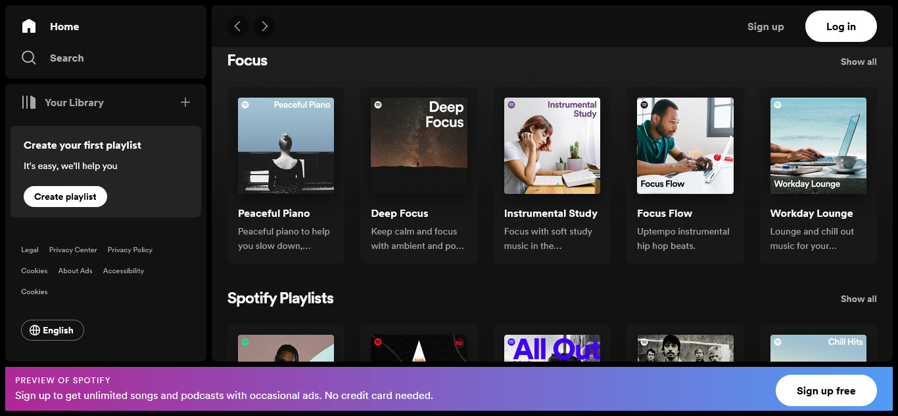
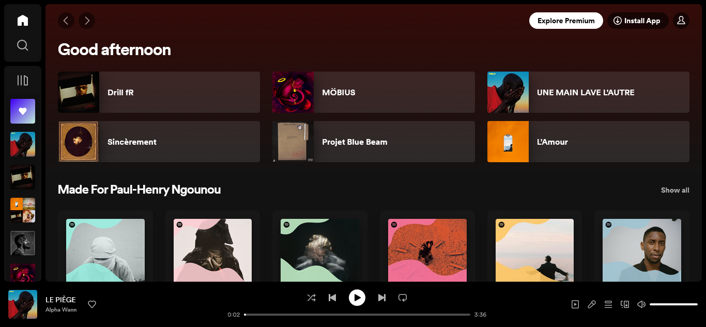
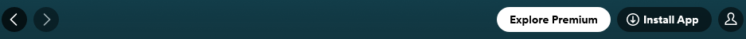
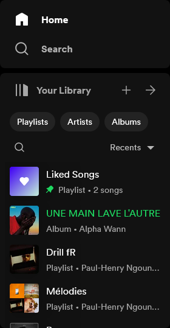
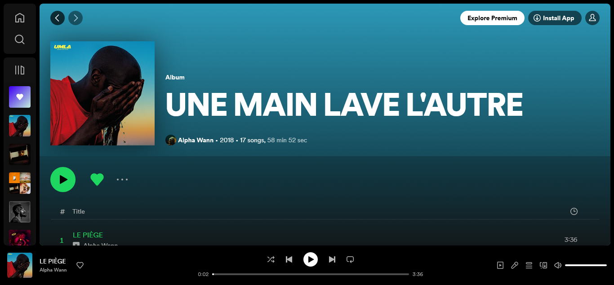
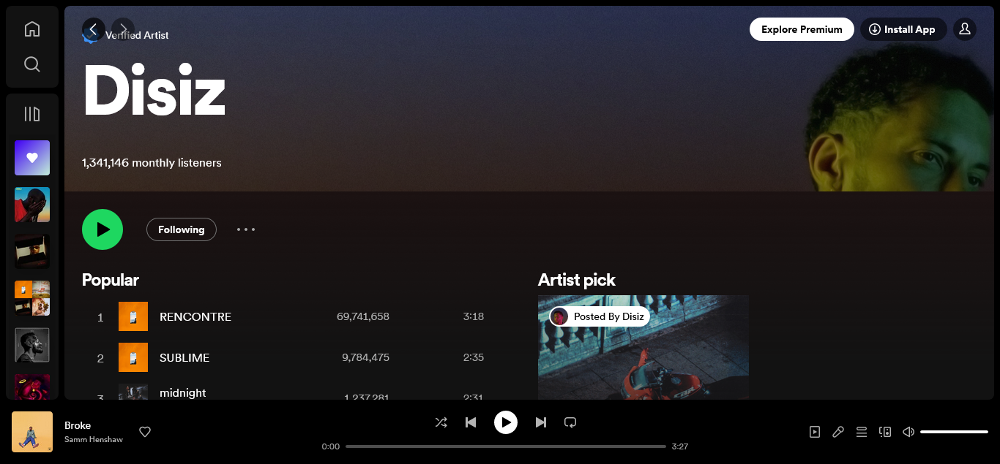
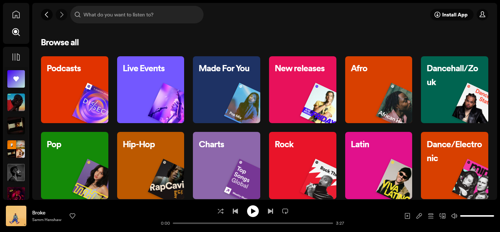
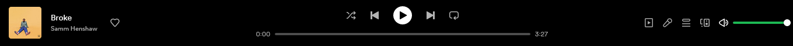

# REACT SPOTIFY ⚛️

Clone of the [Spotify Web Player](https://open.spotify.com/) using **React** & **TailwindCSS**.

## SCOPE

This clone features the following functionalities from the original app:

### Home page

- A guest version for non-logged-in users

- A version for logged-in users

### Navbar & Menu

### Sidebar & Menu

Resizable sidebar containing:

- Home link
- Functional global searchbar
- User library content with search, sorting, filtering

### Collection page

A page to view collection contents (Albums, playlists, mixes, etc...)

### Artist page

### Search page

### Player

## API

Spotify's [Web API](https://developer.spotify.com/documentation/web-api) enables the creation of applications that can interact with Spotify's streaming service, such as retrieving content metadata, getting recommendations, creating and managing playlists, or controlling playback.

## TECH STACK

- [**React**](https://react.dev/) & [React router](https://reactrouter.com/en/main)
- [**TailwindCSS**](https://tailwindcss.com/)
